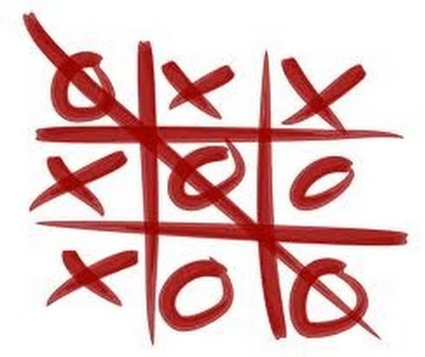

<h1 align="center">
    
</h1>


<h3 align="center">
<a href="https://iagoit.github.io/jogo-da-velha/">Clique aqui para vizualizar a Demonstração</a>
</h3>

<br>

---

# Índice

- [Sobre](#-sobre)
- [Tecnologias Utilizadas](#-tecnologias-utilizadas)
- [Como Baixar o Projeto](#-como-baixar-o-projeto)

---

## 🔖 Sobre

O projeto **Jogo da Velha** é um jogo que foi criado durante o curso Desenvolvimento Web - Udemy.

---

## 🚀 Tecnologias Utilizadas

O projeto foi desenvolvido utilizando as seguintes tecnologias: 

- HTML
- JavaScript
- JQuery

---

## 📦 Como Baixar o Projeto

```bash

    # Clonar o repositório
    $ git clone https://github.com/iagoit/jogo-da-velha

    # Entrar no diretório
    $ cd jogo-da-velha

    # Instalar as dependências
    $ yarn install

    # Iniciar o projeto
    $ yarn start

```

---

<h3 align="center">Desenvolvido por Iago Teixeira Pereira</h3>